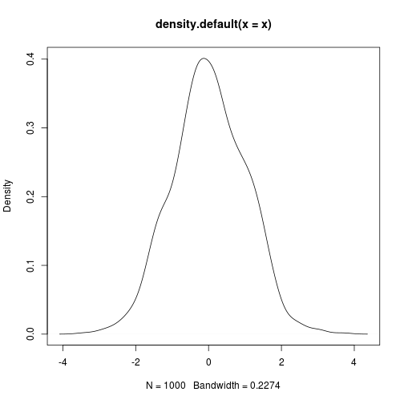

This is an R Markdown document.


```r
x <- rnorm(1000)
head(x)
```

```
## [1] -1.4312432  0.1392884 -0.9480041 -0.2149473 -0.1251113 -1.7540842
```

`knitr` offers a lot of control over representing different
types of output. We can also have inline `R` expressions
computed on the fly.

The mean $\bar{x} = \frac{1}{n} \sum_{i=1}^{n} x_{i}$ of the
1000 random variates we generated is
0.001.

This figure is computed on-the-fly as well. No more
copy-paste, including for figures:


```r
plot(density(x))
```


